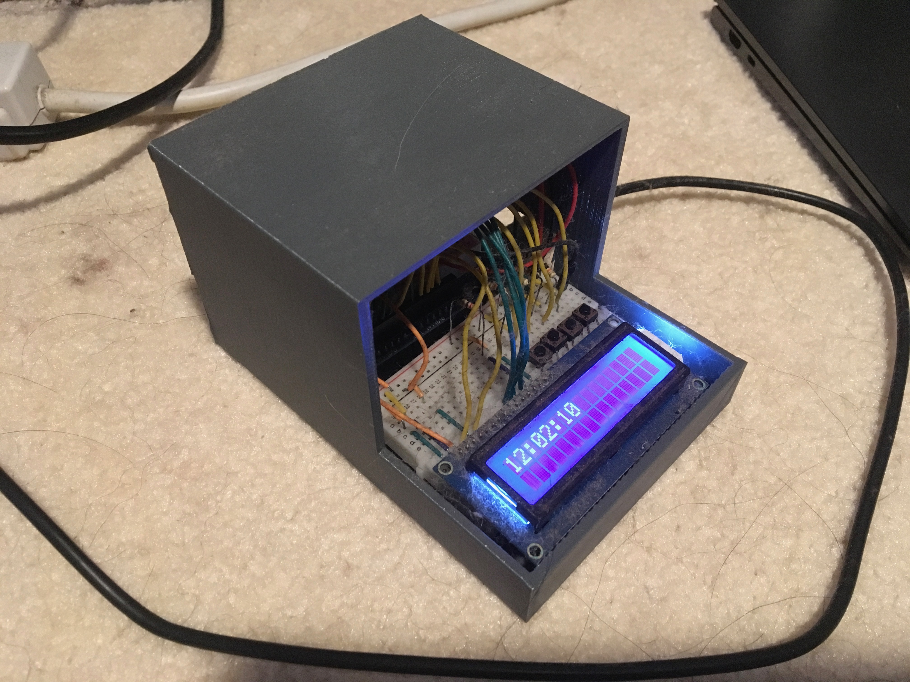

For my introduction to engineering class back in highschool, I created a functioning alarm clock that have several features similiar to that of a standard alarm clock. It can keep track of time, function like a stopwatch, and it can be set up to go off with an alarm. It displays the time through its LED screen, and user interaction involves a couple of buttons.

This project was done solo. I used an Arduino to create the alarm clock. Then, using C, I coded in all the features needed for my project to resemble as close to a normal alarm clock.

I learned a lot about the interaction between software and hardware throughout this project. I also learned to account for many problems and obstacles that could arise and use up time, giving a lesson about time management. Things like bugs in the code can waste a decent amount of time needed to work on the project.
