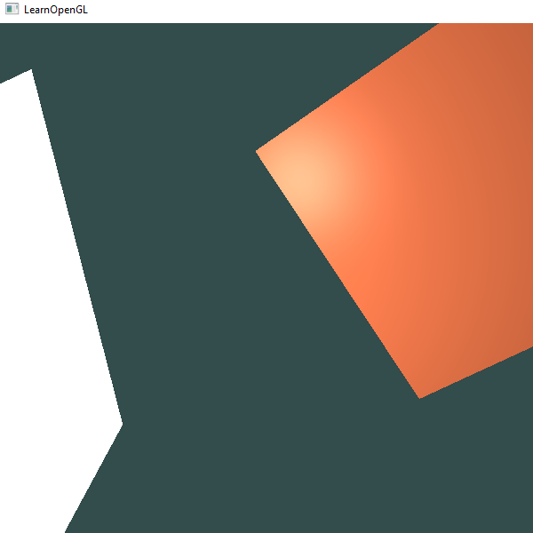
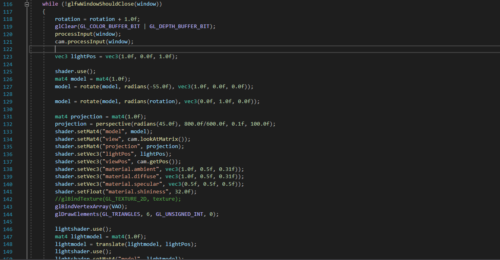

Using C++, OpenGL, and a couple of third party software and APIs like GLFW, I was able to create a 3D scene containing both lighting and an object, a simple orange plane, to demonstrate this lighting effect. The white plane is meant to be used as an indicator where the light source is, as the lightsource is only a single invisible point in space. Since this is only a small project meant for practicing the OpenGL API, the execution merely loads in the scene that I described. However, it also allows control of the camera or display of the scene with the mouse and keyboard.

Although a lot of the code was written by my own hands, since this is practice, I had to use guides and resources like https://learnopengl.com/ to help me set up OpenGL and to create a scene. I learned a lot about the general computer graphics pipeline and how OpenGL works.

Setting up the scene was the easy part. The difficulties and flexibility of working with computer graphics start with interacting with the graphics pipeline itself. A chunk of this pipeline relies on the developer to write code on how the scene would develop. This includes the lighting, the transformations, textures, etc. I recognized that this leaves the developer in a spot where they must have a good understanding of many concepts relating to what they want to create. So, I may be able to load in a scene. However I still have a lot to learn in this vast field.

